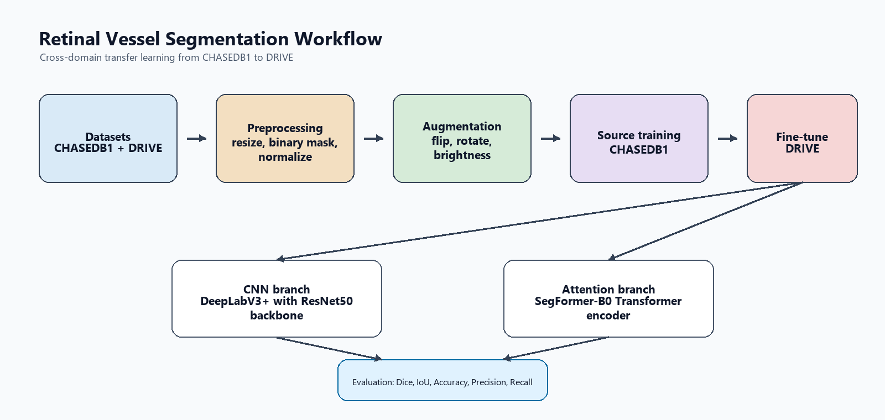
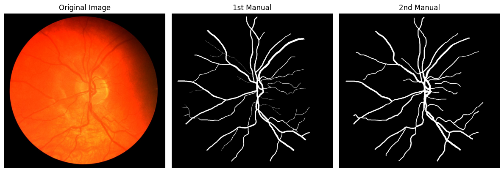
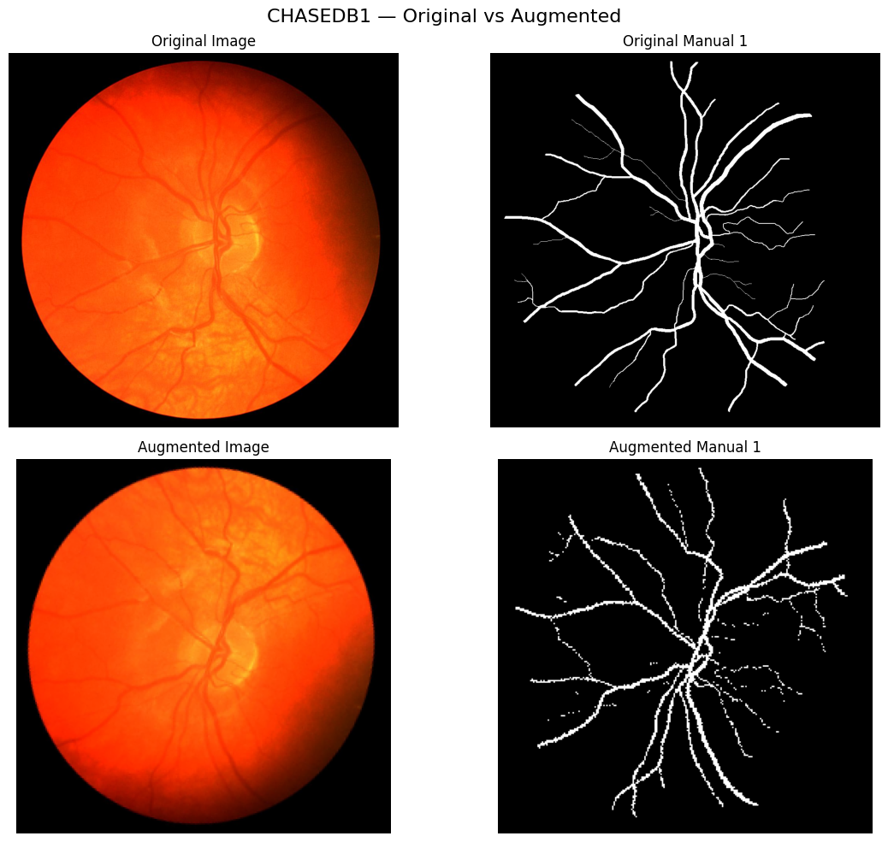
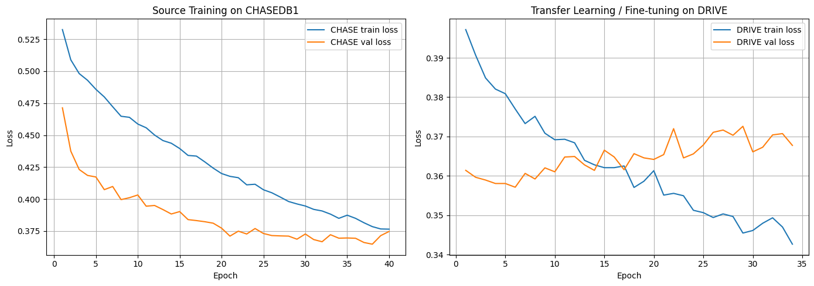
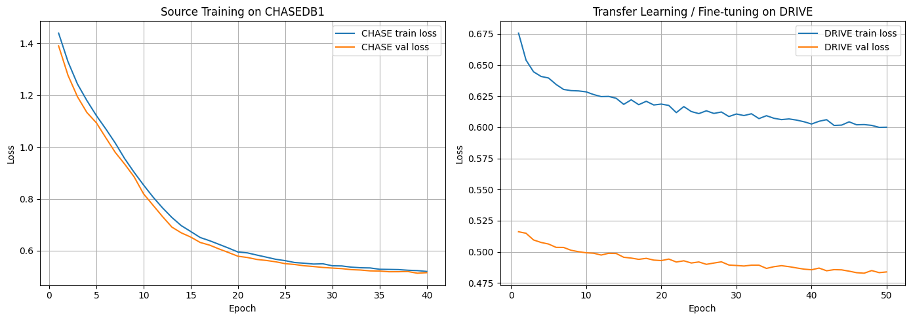
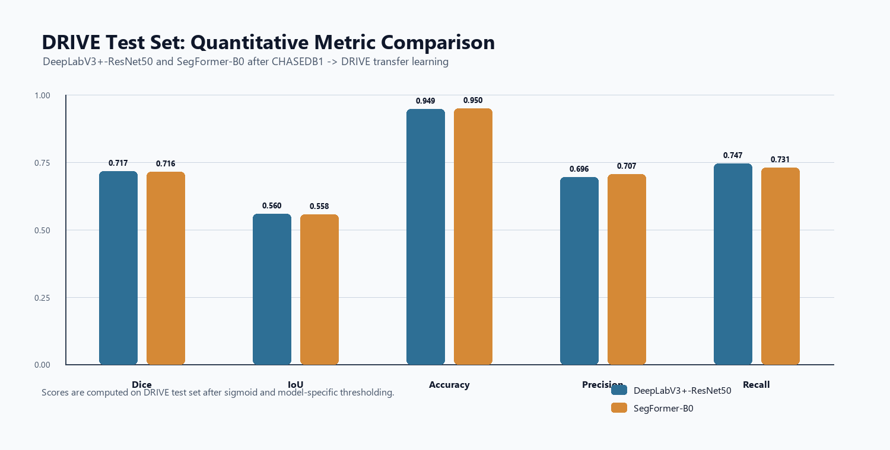
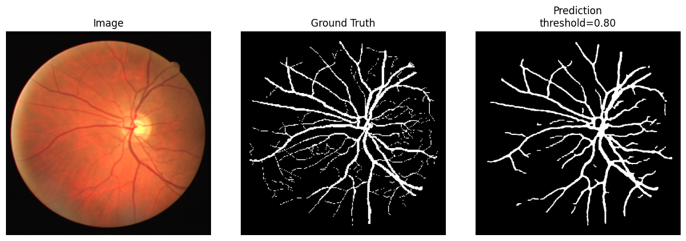
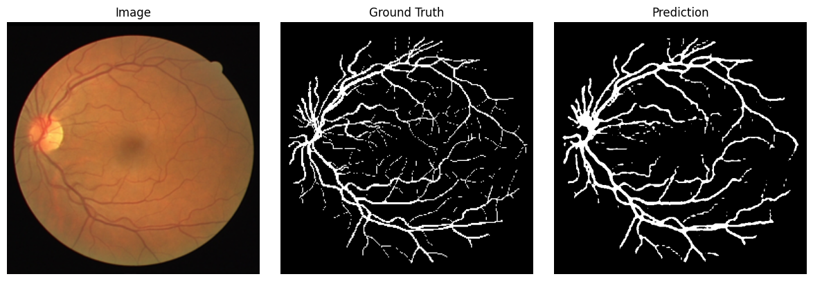
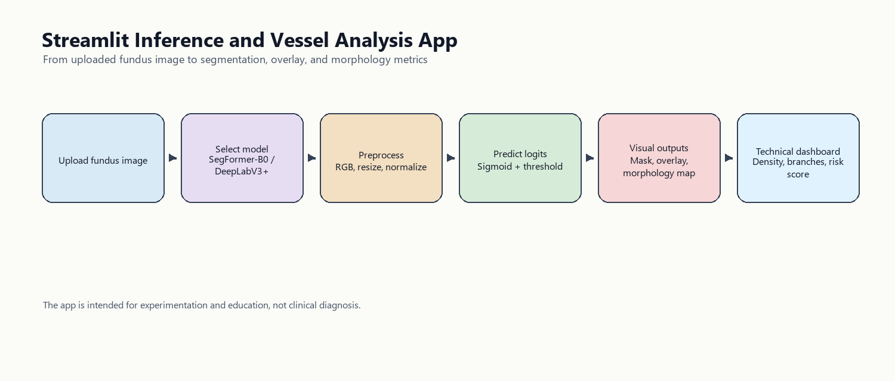

# Retinal Vessel Segmentation with DeepLabV3+-ResNet50 and SegFormer-B0

Đồ án cuối kỳ môn Nhập môn Học sâu về bài toán phân đoạn mạch máu võng mạc trên ảnh đáy mắt. Dự án triển khai và so sánh hai hướng mô hình hiện đại cho semantic segmentation:

- **CNN-based model:** DeepLabV3+-ResNet50, sử dụng backbone ResNet50 pretrained ImageNet.
- **Attention/Transformer-based model:** SegFormer-B0, sử dụng Transformer encoder với cơ chế self-attention.
- **Training strategy:** Transfer learning liên miền từ **CHASEDB1** sang **DRIVE**.
- **Demo application:** Streamlit app cho phép tải ảnh võng mạc, dự đoán mask, hiển thị overlay và phân tích hình thái mạch máu.



## Tóm Tắt Đề Tài

Phân đoạn mạch máu võng mạc là một bước quan trọng trong các hệ thống hỗ trợ phân tích ảnh y khoa, đặc biệt trong các bài toán liên quan đến bệnh võng mạc tiểu đường, tăng huyết áp võng mạc và các bất thường mạch máu. Đầu vào của hệ thống là ảnh fundus RGB, đầu ra là mask nhị phân biểu diễn vùng mạch máu.

Mục tiêu của dự án là xây dựng một pipeline đầy đủ từ tiền xử lý dữ liệu, tăng cường dữ liệu, huấn luyện transfer learning, đánh giá mô hình đến demo ứng dụng. Hai mô hình được chọn để đáp ứng yêu cầu đồ án gồm một kiến trúc CNN và một kiến trúc có cơ chế Attention.

## Đáp Ứng Yêu Cầu Đồ Án

| Yêu cầu | Triển khai trong repo |
| --- | --- |
| Bài toán thuộc nhóm Image Segmentation | Phân đoạn mạch máu võng mạc từ ảnh fundus |
| Kiến trúc CNN | DeepLabV3+-ResNet50 trong `src/models/deeplabv3plus_resnet50.py` |
| Kiến trúc Attention/Transformer | SegFormer-B0 trong `src/models/segformer.py` |
| Bộ dữ liệu phù hợp | DRIVE và CHASEDB1 |
| Tiền xử lý, data augmentation | Resize, chuẩn hóa ImageNet, binary mask, flip, rotate, brightness/contrast |
| Huấn luyện 2 mô hình | Notebook `03` cho DeepLabV3+-ResNet50, notebook `04` cho SegFormer-B0 |
| Phương pháp huấn luyện | Transfer learning CHASEDB1 source training -> DRIVE fine-tuning |
| Chỉ số đánh giá | Dice/F1, IoU, Accuracy, Precision, Recall, validation/test loss |
| Ứng dụng đơn giản | Streamlit app trong `app/streamlit_app.py` |

## Dữ Liệu

Dự án sử dụng hai bộ dữ liệu chuẩn cho retinal vessel segmentation:

| Dataset | Vai trò | Đặc điểm |
| --- | --- | --- |
| **CHASEDB1** | Source domain | Ảnh võng mạc RGB, mỗi ảnh có nhãn thủ công bởi chuyên gia, dùng để học đặc trưng mạch máu tổng quát |
| **DRIVE** | Target domain | Ảnh võng mạc cho bài toán vessel extraction, dùng để fine-tune và đánh giá cuối |

Trong các notebook thực nghiệm chính, ảnh và mask được chuẩn hóa về kích thước 512 x 512 cho huấn luyện và đánh giá. Mask được chuyển về dạng nhị phân một kênh với shape `[B, 1, H, W]`.



## Tiền Xử Lý Và Augmentation

Pipeline tiền xử lý gồm các bước chính:

1. Đọc ảnh fundus ở dạng RGB và đọc mask ở dạng grayscale.
2. Resize ảnh và mask về cùng kích thước.
3. Chuẩn hóa ảnh theo ImageNet mean/std để phù hợp với pretrained backbone/encoder.
4. Chuyển mask về binary 0/1 và thêm channel dimension.
5. Tăng cường dữ liệu trên tập train bằng horizontal flip, vertical flip, rotate và brightness/contrast.



## Kiến Trúc Mô Hình

### DeepLabV3+-ResNet50

DeepLabV3+-ResNet50 được dùng làm mô hình đại diện cho nhóm CNN. Mô hình sử dụng `segmentation_models_pytorch.DeepLabV3Plus` với:

- `encoder_name="resnet50"`.
- `encoder_weights="imagenet"` khi huấn luyện transfer learning.
- `classes=1` để sinh một kênh logits cho binary segmentation.
- `activation=None` để trả về logits thô, phù hợp với `BCEWithLogitsLoss` và các loss kết hợp.

Code chính nằm tại:

```text
src/models/deeplabv3plus_resnet50.py
```

Mô hình kiểm tra input và output shape trong `forward`:

```text
Input : [B, 3, H, W]
Output: [B, 1, H, W]
```

### SegFormer-B0

SegFormer-B0 là mô hình attention-based của dự án. Mô hình dùng `SegformerForSemanticSegmentation` từ Hugging Face Transformers. Cơ chế attention nằm trong MiT Transformer encoder của SegFormer, cho phép mô hình học quan hệ ngữ cảnh toàn cục giữa các vùng ảnh.

Code chính nằm tại:

```text
src/models/segformer.py
```

Các điểm triển khai quan trọng:

- Pretrained checkpoint mặc định: `nvidia/segformer-b0-finetuned-ade-512-512`.
- Chỉnh `num_labels=1` cho bài toán binary segmentation.
- Dùng `ignore_mismatched_sizes=True` khi thay segmentation head đa lớp bằng head một kênh.
- Nội suy logits về đúng kích thước ảnh đầu vào bằng `F.interpolate`.
- Kiểm tra đầu ra cuối cùng phải là `[B, 1, H, W]`.

## Transfer Learning CHASEDB1 -> DRIVE

Hai mô hình được huấn luyện theo cùng chiến lược tổng quát:

1. **Source training trên CHASEDB1:** học đặc trưng hình thái mạch máu từ miền dữ liệu nguồn.
2. **Fine-tuning trên DRIVE:** tải checkpoint tốt nhất từ CHASEDB1 và tiếp tục tinh chỉnh trên DRIVE với learning rate nhỏ hơn.
3. **Validation monitoring:** theo dõi validation Dice/IoU/loss sau mỗi epoch.
4. **Early stopping:** dừng sớm nếu validation metric không cải thiện sau số epoch kiên nhẫn.
5. **Best checkpoint:** lưu checkpoint tốt nhất theo validation Dice hoặc validation IoU tùy notebook.
6. **Final evaluation:** đánh giá trên DRIVE test set và lưu kết quả, history, prediction figures.

Các notebook chính:

| Notebook | Vai trò |
| --- | --- |
| `notebooks/00_EDA_Data.ipynb` | Khám phá dữ liệu, kiểm tra ảnh và mask |
| `notebooks/01_Pretraining.ipynb` | Tiền xử lý, export dữ liệu, kiểm tra DataLoader shape |
| `notebooks/02_SegFormer_B0_DRIVE.ipynb` | Thử nghiệm SegFormer-B0 trực tiếp trên DRIVE |
| `notebooks/03_DeepLabV3Plus_ResNet50_CHASE_to_DRIVE.ipynb` | Transfer learning DeepLabV3+-ResNet50 từ CHASEDB1 sang DRIVE |
| `notebooks/04_SegFormer_B0_CHASE_to_DRIVE.ipynb` | Transfer learning SegFormer-B0 từ CHASEDB1 sang DRIVE |
| `notebooks/environment_setup.ipynb` | Kiểm tra môi trường chạy trên Kaggle |

## Cấu Hình Huấn Luyện

| Thành phần | DeepLabV3+-ResNet50 | SegFormer-B0 |
| --- | --- | --- |
| Input size | 512 x 512 | 512 x 512 |
| Optimizer | AdamW | AdamW |
| Weight decay | 1e-4 | 1e-4 |
| Source domain | CHASEDB1 | CHASEDB1 |
| Target domain | DRIVE | DRIVE |
| Source learning rate | Backbone 1e-5, Head 1e-4 | Encoder 1e-5, Head 1e-4 |
| Target learning rate | Backbone 5e-6, Head 5e-5 | Encoder 5e-6, Head 5e-5 |
| Loss | BCEWithLogits + Tversky | BCEWithLogits |
| Early stopping | Có | Có |
| Main validation metric | Dice/IoU | Dice/IoU |

## Training Curves

DeepLabV3+-ResNet50:



SegFormer-B0:



## Kết Quả Định Lượng

Bảng dưới đây là kết quả tổng hợp cuối trên DRIVE test set sau transfer learning. Logits được đưa qua sigmoid và nhị phân hóa bằng threshold tương ứng với từng mô hình.

| Model | Threshold | Dice/F1 | IoU | Accuracy | Precision | Recall |
| --- | ---: | ---: | ---: | ---: | ---: | ---: |
| DeepLabV3+-ResNet50 | 0.85 | 0.7173 | 0.5596 | 0.9487 | 0.6960 | 0.7471 |
| SegFormer-B0 | 0.50 | 0.7160 | 0.5579 | 0.9495 | 0.7070 | 0.7308 |



### Nhận Xét

DeepLabV3+-ResNet50 đạt Dice và IoU nhỉnh hơn nhẹ, đồng thời có Recall cao hơn. Điều này cho thấy mô hình có xu hướng phát hiện được nhiều vùng mạch máu hơn, đặc biệt là các nhánh nhỏ, nhưng có thể tạo thêm false positive.

SegFormer-B0 có Accuracy và Precision cao hơn. Prediction mask thường sạch hơn và ít nhiễu nền hơn, nhưng một số nhánh mạch nhỏ có thể bị bỏ sót do Recall thấp hơn.

## Kết Quả Trực Quan

DeepLabV3+-ResNet50 prediction example:



SegFormer-B0 prediction example:



Các hình trên được trích từ output notebook chạy thực nghiệm trên Kaggle. Mỗi hình gồm ảnh gốc, ground truth và prediction mask.

## Streamlit Demo App

Ứng dụng demo nằm trong:

```text
app/streamlit_app.py
```

Chức năng chính:

- Tải ảnh võng mạc định dạng PNG/JPG/JPEG.
- Chọn mô hình SegFormer-B0 hoặc DeepLabV3+-ResNet50.
- Chỉnh prediction threshold.
- Sinh probability map và binary vessel mask.
- Hiển thị overlay giữa ảnh gốc và mask.
- Skeletonization và phân tích morphology.
- Xuất prediction mask, overlay image và technical summary.



Lưu ý: app phục vụ mục đích học tập và nghiên cứu, không phải công cụ chẩn đoán y khoa.

## Cấu Trúc Repo

```text
.
|-- app/
|   `-- streamlit_app.py
|-- dataset/
|   |-- CHASEDB1_processed_dataset.zip
|   `-- DRIVE_processed_dataset.zip
|-- docs/
|   `-- images/
|       |-- app_workflow.png
|       |-- dataset_examples.png
|       |-- deeplab_prediction_example.png
|       |-- deeplab_training_curves.png
|       |-- metric_comparison.png
|       |-- preprocessing_augmentation_examples.png
|       |-- project_pipeline.png
|       |-- segformer_prediction_example.png
|       `-- segformer_training_curves.png
|-- notebooks/
|   |-- 00_EDA_Data.ipynb
|   |-- 01_Pretraining.ipynb
|   |-- 02_SegFormer_B0_DRIVE.ipynb
|   |-- 03_DeepLabV3Plus_ResNet50_CHASE_to_DRIVE.ipynb
|   |-- 04_SegFormer_B0_CHASE_to_DRIVE.ipynb
|   `-- environment_setup.ipynb
|-- src/
|   |-- models/
|   |   |-- deeplabv3plus_resnet50.py
|   |   |-- segformer.py
|   |   `-- best_segformer_b0.pth
|   |-- utils/
|   |   |-- losses.py
|   |   `-- metrics.py
|   |-- evaluate.py
|   |-- export_test_dataset.py
|   |-- export_test_images.py
|   |-- predict.py
|   |-- train.py
|   `-- visualize_predictions.py
|-- [Deep Learning] REPORT.pdf
|-- README.md
`-- requirements.txt
```

Một số artifact được tạo sau khi chạy notebook hoặc script:

- `dataset/drive_test_dataset.pt`: file test tensor cho evaluation local.
- `src/models/best_deeplabv3plus_resnet50.pth`: checkpoint DeepLabV3+-ResNet50 sau khi tải từ output Kaggle.
- `outputs/predictions/`: ảnh dự đoán được sinh bởi script visualize.

## Cài Đặt Môi Trường Local

```powershell
python -m venv .venv
.\.venv\Scripts\Activate.ps1
python -m pip install --upgrade pip
pip install -r requirements.txt
```

Nếu chạy trên Kaggle, cài các thư viện trong `requirements.txt` hoặc chạy notebook `notebooks/environment_setup.ipynb` trước.

## Chạy Notebook Trên Kaggle

Quy trình khuyến nghị:

1. Upload hoặc mount `DRIVE_processed_dataset.zip` và `CHASEDB1_processed_dataset.zip`.
2. Chạy `notebooks/environment_setup.ipynb` để kiểm tra thư viện.
3. Chạy `notebooks/00_EDA_Data.ipynb` để kiểm tra dữ liệu.
4. Chạy `notebooks/01_Pretraining.ipynb` để kiểm tra preprocessing và DataLoader.
5. Chạy `notebooks/03_DeepLabV3Plus_ResNet50_CHASE_to_DRIVE.ipynb` để huấn luyện DeepLabV3+-ResNet50.
6. Chạy `notebooks/04_SegFormer_B0_CHASE_to_DRIVE.ipynb` để huấn luyện SegFormer-B0.
7. Tải các checkpoint và file kết quả từ `/kaggle/working`.

Artifact quan trọng từ Kaggle:

```text
/kaggle/working/best_segformer_b0.pth
/kaggle/working/deeplabv3plus_resnet50_outputs/checkpoints/best_deeplabv3plus_resnet50_drive.pth
/kaggle/working/segformer_b0_chase_to_drive/results/segformer_b0_drive_results.csv
/kaggle/working/deeplabv3plus_resnet50_outputs/results/deeplabv3plus_resnet50_drive_test_results.csv
```

Khi đưa về repo local, nên đặt checkpoint theo tên:

```text
src/models/best_segformer_b0.pth
src/models/best_deeplabv3plus_resnet50.pth
```

## Chuẩn Bị Test Dataset Local

File `.pt` dùng cho `src/evaluate.py` có thể được export từ zip DRIVE đã xử lý:

```powershell
python src\export_test_dataset.py `
  --zip dataset\DRIVE_processed_dataset.zip `
  --output dataset\drive_test_dataset.pt `
  --image-size 512
```

Kiểm tra ảnh test đã export:

```powershell
python src\export_test_images.py `
  --data dataset\drive_test_dataset.pt `
  --output outputs\app_test_images_full
```

## Đánh Giá Mô Hình Local

SegFormer-B0:

```powershell
python src\evaluate.py `
  --model segformer_b0 `
  --checkpoint src\models\best_segformer_b0.pth `
  --data dataset\drive_test_dataset.pt `
  --batch-size 4 `
  --threshold 0.50
```

DeepLabV3+-ResNet50:

```powershell
python src\evaluate.py `
  --model deeplabv3plus_resnet50 `
  --checkpoint src\models\best_deeplabv3plus_resnet50.pth `
  --data dataset\drive_test_dataset.pt `
  --batch-size 2 `
  --threshold 0.85
```

Đánh giá cả hai mô hình nếu đã có đủ checkpoint:

```powershell
python src\evaluate.py `
  --model all `
  --data dataset\drive_test_dataset.pt `
  --batch-size 2
```

Tìm threshold tốt nhất theo Dice:

```powershell
python src\evaluate.py `
  --model segformer_b0 `
  --checkpoint src\models\best_segformer_b0.pth `
  --data dataset\drive_test_dataset.pt `
  --batch-size 4 `
  --tune-threshold `
  --threshold-min 0.30 `
  --threshold-max 0.85 `
  --threshold-step 0.05
```

## Sinh Ảnh Prediction Local

```powershell
python src\visualize_predictions.py `
  --model segformer_b0 `
  --checkpoint src\models\best_segformer_b0.pth `
  --data dataset\drive_test_dataset.pt `
  --threshold 0.50 `
  --num-samples 5 `
  --output-dir outputs\predictions
```

## Chạy Ứng Dụng

```powershell
streamlit run app\streamlit_app.py
```

Ứng dụng mặc định đọc checkpoint trong `src/models/`. Repo hiện có checkpoint SegFormer-B0. Nếu muốn chạy DeepLabV3+-ResNet50 trong app, cần tải checkpoint DeepLab từ output Kaggle và đặt đúng tên `src/models/best_deeplabv3plus_resnet50.pth`.

## Vị Trí Code Quan Trọng

| Thành phần | File |
| --- | --- |
| SegFormer-B0 attention model | `src/models/segformer.py` |
| DeepLabV3+-ResNet50 CNN model | `src/models/deeplabv3plus_resnet50.py` |
| Metric functions | `src/utils/metrics.py` |
| Loss functions | `src/utils/losses.py` |
| Evaluation CLI | `src/evaluate.py` |
| Prediction visualization | `src/visualize_predictions.py` |
| DRIVE test export | `src/export_test_dataset.py` |
| Streamlit app | `app/streamlit_app.py` |

## Hạn Chế Và Hướng Phát Triển

Hạn chế chính của dự án là kích thước dữ liệu còn nhỏ, domain shift giữa CHASEDB1 và DRIVE vẫn ảnh hưởng đến các nhánh mạch nhỏ, và risk score trong app mới là chỉ số minh họa rule-based, chưa có giá trị lâm sàng.

Các hướng phát triển tiếp theo:

- Mở rộng dữ liệu với các bộ retinal vessel segmentation khác.
- Thử nghiệm post-processing để nối các nhánh mạch bị đứt đoạn.
- Tune threshold riêng theo từng mô hình và từng tập validation.
- Bổ sung calibration và uncertainty estimation.
- Cải thiện app thành dashboard so sánh nhiều mô hình trên cùng ảnh.

## Tài Liệu Tham Khảo

1. Fraz, M. M., et al. (2012). An ensemble classification-based approach applied to retinal blood vessel segmentation. *IEEE Transactions on Biomedical Engineering*.
2. Staal, J., et al. (2004). Ridge-based vessel segmentation in color images of the retina. *IEEE Transactions on Medical Imaging*.
3. Chen, L.-C., et al. (2018). Encoder-decoder with atrous separable convolution for semantic image segmentation. *ECCV*.
4. He, K., et al. (2016). Deep residual learning for image recognition. *CVPR*.
5. Xie, E., et al. (2021). SegFormer: Simple and efficient design for semantic segmentation with Transformers. *NeurIPS*.
